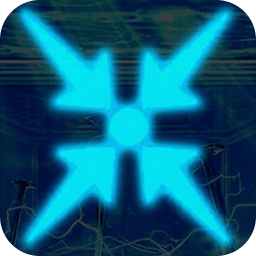

<div align="center">
  
  <h1>Charge-Grinder — ESP32 Hardware Edition</h1>
  <p><b>An advanced Mirror Dungeon farming bot for Limbus Company.</b></p>
  <p><i>Forked and heavily modified from <a href="https://github.com/Walpth/Charge-Grinder">Walpth/Charge-Grinder</a></i></p>
</div>

---


## 🛠️ Bot Features (Software)

- **Complete Automation:** Fully autonomus Mirror Dungeon Normal/Hard modes and Luxcavation farming.
- **Dynamic Teams:** Setup custom team synergies, affinity priorities, and win-rates.
- **Human-Like Profiles:** Integrated profile jittering, cursor curves, and rhythm variance (`profiles.py`) so your inputs never look perfectly robotic.
- **GUI Interface:** Written in PySide6 (`App.py`) with intuitive setup flows and settings management.
- **Auto-Recovery:** If the game errors out or the bot gets stuck, it handles disconnections automatically and restarts processes.

---

## 🥇 Option A: Setup ESP32-S3 (USB HID - Recommended)

*Use this if you have an ESP32-S3 board. It requires only one cable for power, data, and bot commands.*

### 1. Flash the Firmware
1. Open `esp32_firmware/esp32s3_usb_hid.ino` in Arduino IDE.
2. Select your board and set the following settings in `Tools`:
   - **Board:** ESP32-S3 Dev Module
   - **USB Mode:** `USB-OTG (TinyUSB)` *(Critical)*
   - **USB CDC On Boot:** `Enabled` *(Critical for COM port communication)*
3. Hit **Upload**.

### 2. LED Behavior (ESP32-S3)
The onboard WS2812 RGB LED (Pin 48) indicates connection status:
* 🟡 **Yellow blink:** Booting / Initializing USB Drivers
* 🟣 **Purple solid:** Ready (Waiting for Bot to connect)
* 🔵 **Blue solid:** Active (Executing Mouse/Keyboard commands)
* 🟢 **Green blink:** Idle (Python script disconnected / Grinding finished)
* 🔴 **Red flash:** Error (Received an invalid command block)

---

## 🥈 Option B: Setup Standard ESP32 (WiFi / Bluetooth)

*Use this if you have a traditional ESP32 WROOM-32/WROVER board lacking native USB output.*

### 1. Install Arduino BLE Library
1. Install **ESP32-BLE-Combo** library:
   - Download from [GitHub](https://github.com/blackketter/ESP32-BLE-Combo)
   - `Sketch → Include Library → Add .ZIP Library`

### 2. Flash the Firmware
Choose the firmware based on your connection mode:

- **WiFi TCP mode (Recommended):** Open `esp32_firmware/esp32_bt_hid.ino`. Edit the `WIFI_SSID` and `WIFI_PASS` variables to match your home network, then upload to your ESP32. (Check your Arduino Serial Monitor after flashing to find your ESP32's assigned IP address).
- **Bluetooth SPP mode:** Open `esp32_firmware/esp32_bt_hid_bluetooth.ino` and upload it. 

### 3. Pair BLE HID to Windows
1. Open Windows Settings → `Bluetooth & devices` → `Add device`.
2. Pair the newly found device named **"Activision"** as a Bluetooth keyboard/mouse.

---

## 🚀 Running the Bot

### For Standard Users
1. Download the latest compiled `.exe` from the [Releases page](https://github.com/PhaiKub/Activision/releases/latest).
2. Connect your ESP32-S3 (via USB) or your ESP32 (via WiFi/Bluetooth).
3. Keep Limbus Company running in the foreground (English, 16:9 ratio, 1920x1080 strongly recommended).
4. Run `App.exe`.
5. The application will auto-detect your ESP32. 
   - *If using ESP32-S3:* It will look for the designated COM port.
   - *If using ESP32 (WiFi):* A pop-up will ask you for the ESP32's IP Address the first time.
   - Values are saved in `esp32_config.json` automatically.
6. Pick your grinding settings and click **Start**.

### For Developers (Python Environment)
1. Clone the repository and install requirements:
   ```powershell
   git clone https://github.com/PhaiKub/Activision.git
   cd Activision
   pip install -r requirements.txt
   ```
2. Run the Bot GUI:
   ```powershell
   python App.py
   ```

*(You can use `python test_esp32s3.py` to directly debug ESP32-S3 USB connections, or `python testping_esp32.py` for older ESP32 WiFi/BLE connectivity metrics).*

---

## ⚠️ Requirements & Best Practices
- **Never minimize the game.** The bot reads visual pixels using Windows API Screen Capture to decide navigation routes (handled in `source/utils.py`). The game must remain visible.
- **No Mods.** Custom UI, speech bubble mods, or localization mods alter the pixel layouts and will cause the OCR/pixel detection to misfire. Disable all of them.
- **Resolution matters.** The bot is mathematically scaled based on `1920x1080` (16:9). Playing in odd unscaled windowed corners will cause pathing failures.

---

## 📜 License & Credits

This project operates under the **GNU General Public License v3.0**. Read `LICENSE` for full commercial/distribution constraints.

**Modifications (Activision 2026 - PhaiKub & Colors):**
- Transitioned off driver-level hooks.
- Implemented **ESP32-S3 USB HID Combo** hardware bridge.
- Maintained **ESP32 WiFi/BlueTooth HID** backward compatibility support.
- GUI modernization. 
- Integrated human-style randomization offsets.

**Original Concept:**
- Based heavily on the phenomenal automation groundwork laid down by [Walpth/Charge-Grinder](https://github.com/Walpth/Charge-Grinder). All logic flow mapping credits to the original author.
- **BLE HID library:** [ESP32-BLE-Combo](https://github.com/blackketter/ESP32-BLE-Combo) by blackketter.
